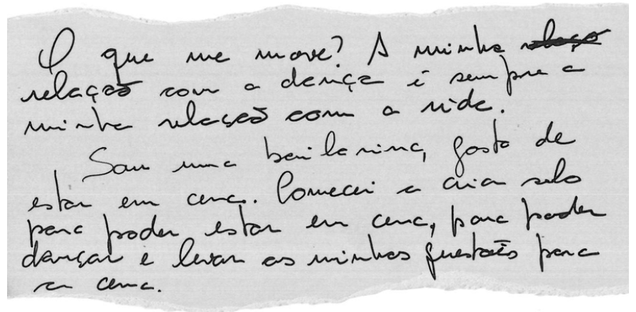

# 🔍 Text Recognition in Images Project / Projeto de Reconhecimento de Texto em Imagens

## 📝 Description / Descrição

Project developed to demonstrate the application of text recognition techniques in images using AI. 🤖✨  

Projeto desenvolvido para demonstrar a aplicação de técnicas de reconhecimento de texto em imagens usando I.A. 🤖✨

---

## 🎯 Objective / Objetivo

Extract text from different types of images and document the process and results obtained. 📄🖼️  

Extrair texto de diferentes tipos de imagens e documentar o processo e resultados obtidos. 📄🖼️

---

## 📁 Project Structure / Estrutura do Projeto

- `inputs/`: Folder containing the original images used 📂  
  Pasta contendo as imagens originais utilizadas 📂  
- `outputs/`: Folder containing the text recognition results 📂  
  Pasta contendo os resultados do reconhecimento de texto 📂  
- `README.md`: Project documentation 📄  
  Documentação do projeto 📄  

---

## 🛠️ Technologies Used / Tecnologias Utilizadas

- **Claude 3.5 Sonnet** 🤖  
- **Azure I.A** (UNAVAILABLE) ⚠️  

- **Claude 3.5 Sonnet** 🤖  
- **Azure I.A** (INDISPONÍVEL) ⚠️  

---

## 📊 Results / Resultados

### Example 1: Handwritten Text / Exemplo 1: Manuscrito
  
- **Result:** [View extracted text](Outputs/resultado1_Manuscrito.txt) 📄  
  **Resultado:** [Ver texto extraído](Outputs/resultado1_Manuscrito.txt) 📄  
- **Accuracy:** 90% to 95% 🎯  
  **Precisão:** 90% a 95% 🎯  

### Example 2: PDF / Exemplo 2: PDF
  
- **Result:** [View extracted text](Outputs/resultado2_PDF_Para_Analise_Projeto_I.A.txt) 📄  
  **Resultado:** [Ver texto extraído](Outputs/resultado2_PDF_Para_Analise_Projeto_I.A.txt) 📄  
- **Accuracy:** 90% 🎯  
  **Precisão:** 90% 🎯  

### Example 3: Signage Plate / Exemplo 3: Placa de Sinalização
  
- **Result:** [View extracted text](Outputs/resultado3_Placa_Sinalização.txt) 📄  
  **Resultado:** [Ver texto extraído](Outputs/resultado3_Placa_Sinalização.txt) 📄  
- **Accuracy:** Main plate: 100% (total clarity) - Background plates: 85% 🎯  
  **Precisão:** Placa principal: 100% (clareza total) - Placas ao fundo: 85% 🎯  

---

## 💡 Insights and Learnings / Insights e Aprendizados

1. Image quality directly affects recognition accuracy 🖼️🎯  
   A qualidade da imagem afeta diretamente a precisão do reconhecimento 🖼️🎯  
2. Texts with standardized fonts have better recognition rates ✍️📄  
   Textos com fontes padronizadas têm melhor taxa de reconhecimento ✍️📄  
3. Image preprocessing can significantly improve results 🛠️📈  
   O pré-processamento das imagens pode melhorar significativamente os resultados 🛠️📈  

---

## 🚀 Future Possibilities / Possibilidades Futuras

- Implementation of automatic text correction 🤖📝  
  Implementação de correção automática de texto 🤖📝  
- Integration with translation systems 🌐🔠  
  Integração com sistemas de tradução 🌐🔠  
- Development of a graphical interface 🖥️🎨  
  Desenvolvimento de interface gráfica 🖥️🎨  
- Optimization for specific documents 📄⚙️  
  Otimização para documentos específicos 📄⚙️  

